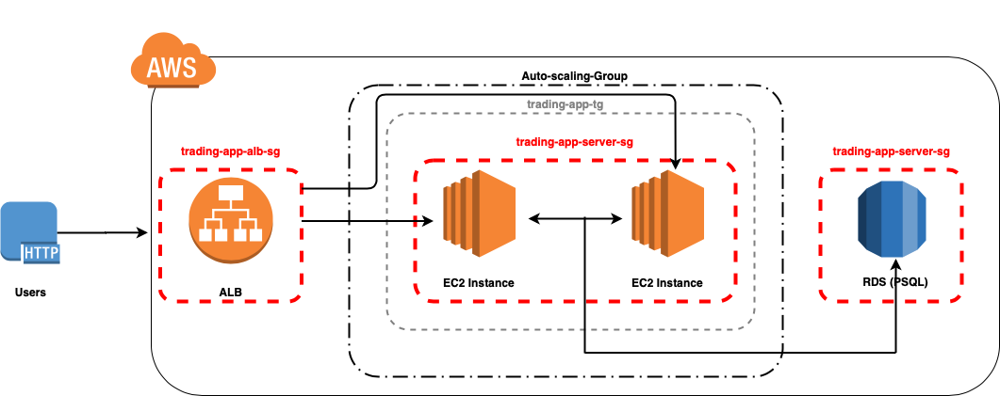
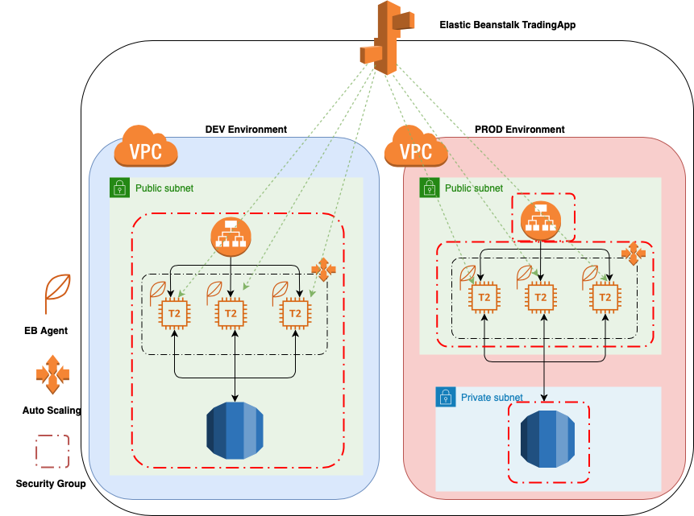
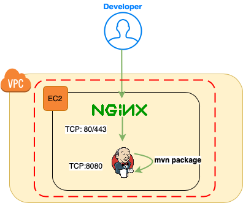
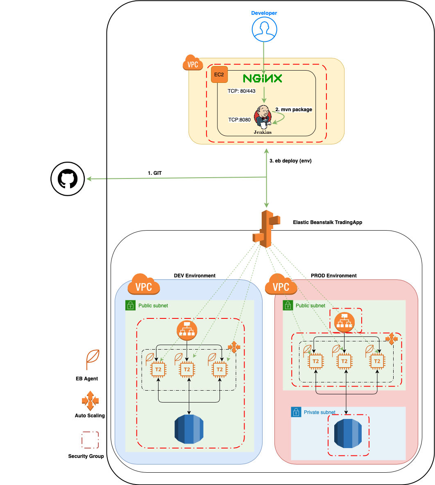

# Introduction

This project focuses on deploying Springboot stock market trading application on the Amazon Web Services (AWS) cloud inorder to have scalability, elasticity, and high availability.
The main purpose of Springboot project is to develop a three-tier Microservice REST API based application with SpringBoot framework, 
which provides an online trading platform to sell or buy stocks. The cloud services that are used during the app development are: 
- Virtual Private Cloud (Security Groups, Network Access Control Lists, Route Tables)
- Elastic Cloud Compute (EC2)
- Amazon Relational Database System (RDS)
- Elastic Beanstalk (EB)
 Also, Jenkins was used to create a Continuous Integration and Continuous Delivery (CI/CD) pipeline that automatically fasten the deployment life cycle by continuously pulling the application from Github repository and deploying it.                                                                                                                     

# Application Cloud Architecture

The cloud architecture diagram is illustrated below:

The Application Load Balancer (ALB) takes the incoming HTTP requests from the users and automatically distributes the incoming traffic across multiple targets that are available to receive requests. 
The Auto Scaling group monitors application and automatically adjust the capacity by determining if a new instance should be created, or if an instance should be terminated. 
The ALB also performs health checks on the instances and prevents direct requests to unhealthy instances. 
As a result, this application would be both scalable and elastic through the help of Application Load Balancer and Auto Scaling Group.

# Deployment Environments
Elastic Beanstalk (EB) provisions AWS infrastructures and deploys the application. EB is used to create two environment: 1. DEV environment 2.PROD environment 

The diagram below shows these two application environment:

Both environments have their own set of EC2 instances, RDS instances, and network infrastructure. The DEV environment is for developing purposes, while the
PROD environment will be consumed by clients.

# Jenkins Server
	
- Jenkins is a free and open source continuous integration/continuous delivery and deployment (CI/CD) automation server that helps to automate the  development process. 
- A Nginx HTTPS reverse proxy is an intermediary proxy service which takes a client request, passes it on to one or more servers, and subsequently delivers the server's response back to the client.
    

# Jenkins CI/CD pipeline
Jenkins' pipelines are able to executes deployment commands automatically on a Jenkins Server. 

As shown in the diagram above, the pipeline execution through Jenkins file follows the steps below: 

1. Downloads the git repository source code through the provided credentials
2. `mvn clean package` command, which generates a zip file for the EB deployment.
3. `eb deploy` command, which deploys the generated zip file into the corresponding EB environment.

# Improvements
- Creating more environments for different branches
- Testing the elasticity and scalability by increasing incoming traffic and having more clients
- Exploration of AWS tool fto get more familiar with different AWS Services.
