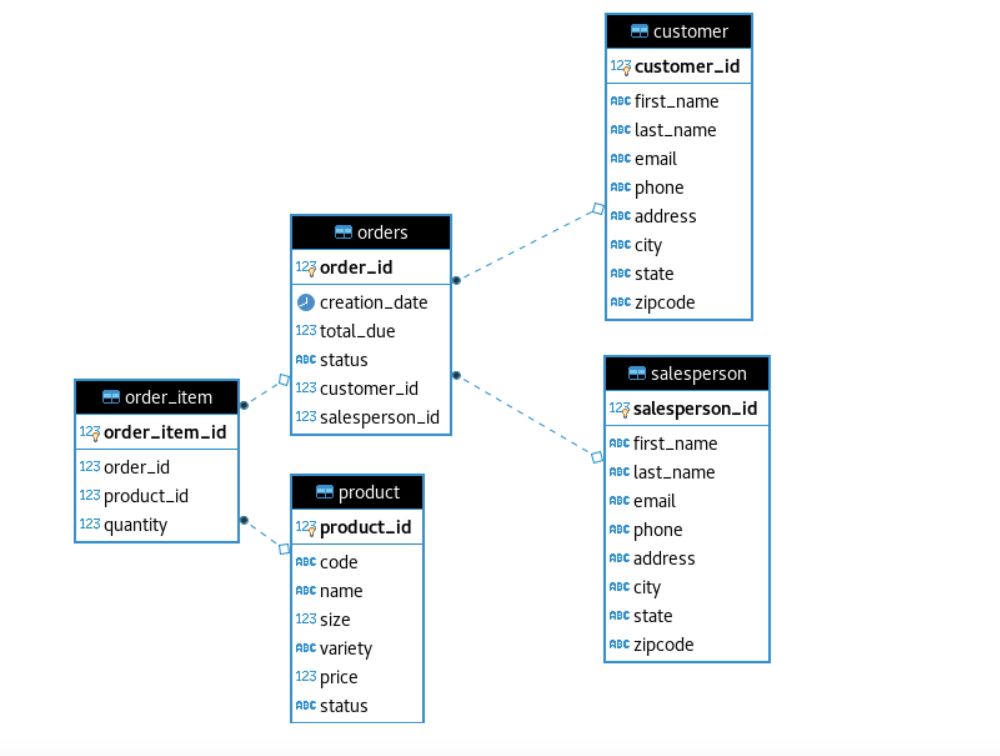

# Introduction
JDBC (Java Database Connectivity) acts as a bridge between the RDBMS and the Java application. This application allows users to connect to PostgreSQL and perform CRUD operations (Create, Read, Update, Delete). 
This project has followed 
Frank Moley's [Learning JDBC Course](https://www.lynda.com/Java-tutorials/Get-going-data-access-Java/779748/5033983-4.html) in Lynda and was implemented for learning purposes. Main learning outcomes of this project are included but not limited to:
Data Access Objects (DAOs) patterns, Repository patterns, understanding transactions, commits & rollbacks as well as exception handling in JDBC. 

# ER Diagram

# Design Patterns
Two design patterns are discussed to make an abstraction layer between the raw JDBC code and the rest of the application:
Data Access Object (DAO) Pattern and Repository Pattern. The main difference between these two patterns is that the repository pattern focuses only on single table access per class, while in DAO multiple data tables can be accessed. 
Choosing the proper design pattern highly depends on the database characteristic. For instance, it is better to use repository pattern in distributed databases.

 