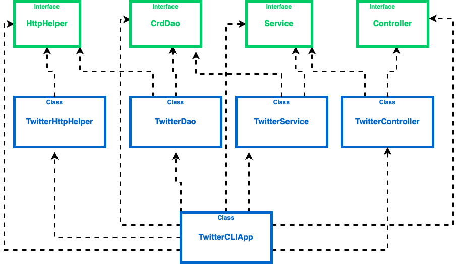

# Introduction

The Twitter CLI application allows users to create a tweet with a geotag via Twitter REST API and output the created tweet object in JSON format. 
This application throws an exception in case the length of the tweet is over 140 characters ,or the geo tag format is invalid (For example, the latitude or longitude is out of range).
Through this MVC (minus V) based application the user can also lookup or delete a tweet by ID and send an error message if the provided ID is invalid.

Implementing this application is a great practice to gain valuable hands-on experience and better understanding of concepts below:
- Different design patterns(DTO, DAO,CRUD and MVC)
- Various Java libraries (HTTP Client, JSON serializer/deserializer) 
- Testing frameworks like Junit and Mockito
- Spring frameworks
# Quick Start

## Package the app using mvn
1. The first step is to set Twitter authorization keys (consumerKey, consumerSecret, accessToken, TokenSecret) as environment variables.
2. The following command line builds the package : ``mvn package`` 
3. The following command line runs this application:  
``java -jar target/ twitter-1.0-SNAPSHOT.jar [post|show|delete] [arguments]``

## Running the app
- Post a tweet: ``twitterCLIApp post "sample text" "Longitude:Latitude"``
- Show a tweet: ``twitterCLIApp show "ID" "sample text"``
- Delete a tweet: ``twitterCLIApp delete "ID" "sample text" ``

# Design
## UML diagram

The application consists of the following components:

- Controller Layer

    The controller layer interacts and parsers user input (CLI arguments). It also calls the service layer and returns results.

- Service Layer

    The service layer handles business logic and calls DAO layer in order to interact with the underlying storage/service which is the Twitter REST API in this app.

- Data Access Layer (DAO)

    The data access layer handles models (implemented with POJOs). In this app, the DAO layer posts/shows/deletes tweet(s).

# Spring

In the TwitterCLIApp, the `main` method is used to create all components and the dependencies are setup manually. Since it will become extremely difficult to manage  dozens of components that each might require more than one dependency,
Spring framework is used in this app. 
In general, the Spring framework solves the Dependency management(DM) problem. This framework has two most fundamental components: IoC container, and Beans.
## IoC container
IoC is also known as dependency injection (DI). (IoC and DI are used interchangeably). It is a process whereby objects define their dependencies only through constructor arguments. The IoC container then injects those dependencies when it creates the bean. This process is fundamentally the inverse (hence the name, Inversion of Control) of the bean itself controlling the instantiation or location of its dependencies.
## Beans
There are six components that are managed by the IoC container. These components/dependencies are call Beans in the Spring world. In other words, if a component/class/object is created/managed by an IoC container, it's a bean. In TwitterCLIApp, TwitterController, TwitterService, TwitterDao, and TwitterHttpHelper are Beans since they care created by the main method. Models are not Beans since they are not managed by the main method.
## Spring Framework
### Beans approach
1. Define dependency relationship using `@Bean` and pass dependencies through method arguments
2. Create an IoC container/context which will automatically instantiate all Beans base on the relationship you specified in the previous step.
3. Get the main entry point (TwitterCLIApp) from the IoC container and start the program
### ComponentScan approach
Although the `@Bean` approach replaced the traditional `main` method dependency management, it still requires a lot of manual work which requires developers to specify Beans and dependencies one by one. 

When you implement an interface, you actually pass the dependencies through constructors (this implies dependency relationship too), we can actually take advantage of this and eliminate all manual work.

For instance, `TwitterController` depends on Service. We can use `@Autowired` annotation to tell IoC container to inject dependency through the constructor. In addition, you need `@Controller` (`@org.springframework.stereotype.Controller` in this case since there is a naming conflict) to tell IoC container this class is a Bean (which will be managed by IoC container).

###SpringBoot
Spring Boot is basically an extension of the Spring framework which eliminated the boilerplate configurations required for setting up a Spring application. In addition, Spring Boot also comes with a default web servlet.
# Models
Models are implemented with POJOs, which is a class with private member variables and public getter and setters. This class encapsulates Tweet data, which often is displayed in JSON format.

The Model contains of five objects: Tweet, Coordines, Entities, Hashtag, and UserMention. The Tweet model is used to store the HTTP response in Json format from the Twitter server and the properties are parsed to Tweet object using JsonParser in dao package. An sample Json with interested properties used in the application is shown below.

# Improvements
1. Adding a new feature for updating tweets.
2. An additional feature that the user can post images as well.
3. Adding an option that tweets could be found from the posted time.