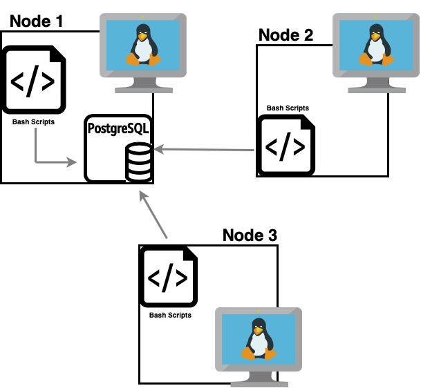

# Linux Cluster Monitoring Agent

## Introduction
Cluster Monitor Agent is a real-time internal tool that helps Linux Cluster Administration (LCA) team to collect and record the hardware specifications and node resource usages, such as CPU and memory information. The collected data is stored in a locally hosted PostgreSQL database and can be used for generating technical report.  
Based on this generated report, better troubleshooting or resource planning would be performed by infrastructure team.

## Architecture and Design

1) Draw a cluster diagram with three Linux hosts, a DB, and agents
2) Describe tables
3) Describe scripts

## Usage
1) how to init database and tables
2) host_info usage
3) host_usage usage
4) crontab setup

## Improvements
Write at least three things you want to improve 
e.g. 
1) handle hardware update 

