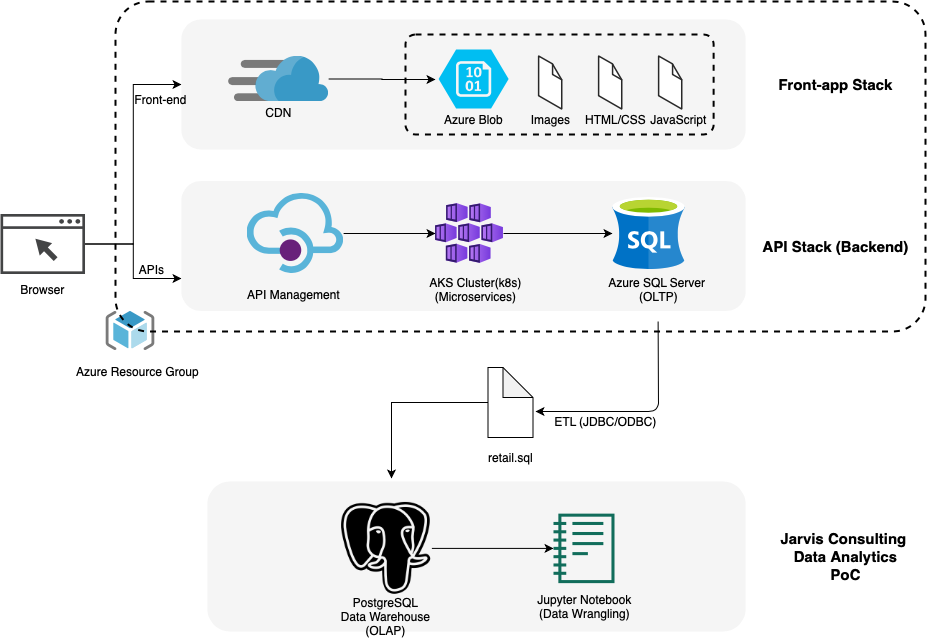

# Introduction
London Gift Shop (LGS) is a UK-based online store that sells giftware to wholesalers. 
It has been more than 10 years that the company is running its online platform, but their revenue is decreasing in the recent years. 
This project delivers a proof of concept (PoC) to answer specific business questions of the LGS marketing team by utilizing their transaction dataset from 01/12/2009 and 09/12/2011. 

Python, Jupyter Notebook, Pandas DataFrame, and Numpy are the main tools used in this project to perform data analytics. 
The provided data is stored in a PostgreSQL database, which is provisioned using a docker container and is connected to the Jupyter Notebook. 
The solutions are presented by using tables and plots. 

# Project Architecture
The high level system design of this project is illustrated below:

The web application that LGS uses is consisted of frontend and backend stack. 
The frontend uses Azure Content Delivery (CDN) with image, HTML, CSS and JavaScript files, while the backend consists of API management, Kubernetes and SQL server for OLTP data.  
The retail data, which is used in this PoC is driven from the SQL server and is stored in the PSQL Database. This data is pulled to Jupyter notebook, which the data analytics is performed on

# Data Analytics and Wrangling
The proof of concept of this project is an ipynb file, which can be found [here](https://github.com/jarviscanada/jarvis_data_eng_farnaz/blob/master/python_data_wrangling/retail_data_analytics_wrangling.ipynb) 
Different business analysis is performed in this notebook such as finding total invoice amount, the monthly placed and canceled orders as well as plotting their distribution; visualizing monthly sales growth and monthly active users. 
Also, the report and segmentations for each RFM parameter are created inside a table. 
These analyses can help the LGS company to improve their sales revenue based on the results of this project. 
For example, the “Champions” category denotes the data of the customers who purchase more frequently and are responsible for the large portion of the company revenue. 
They are highly valuable and they should be taken into consideration to keep them engaged by providing them more rewards. 

# Improvements
- Using the most updated data to have more accurate analysis.
- Implementing linear regression to predict future sales
- Investigating in which gifts were purchased the most and the least
