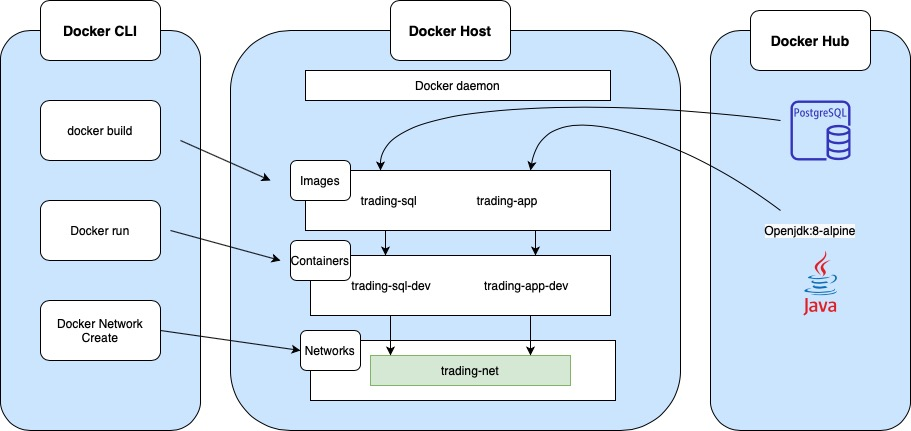

#Springboot Trading Application
Table of contents
* [Introduction](##Introduction)
* [Quick Start](##Quick Start)
* [Architecture](##Architecture)
* [REST API Usage](##REST API Usage)
* [Docker Deployment](##Docker Deployment)
* [Improvements](##Improvements)
## Introduction

This is a REST API application which provides an online stock trading platform. By using IEX cloud as a data source, users can run this application to create and store traders,accounts, quotes, and security orders data into PSQL database. 
This Microservice MVC architecture application is built with the Springboot framework and deployed by Docker containers.

## Quick Start
- The first step is to setup environmental variable, which is API Token <br />
```export IEX_PUB_TOKEN="Insert your API Token here"```
- Confirm to have docker version of 17.05 or higher <br />
```docker -v```
- Install the latest docker if your docker version is old <br />
    ``` 
    sudo yum remove -y docker \
                         docker-client \
                         docker-client-latest \
                         docker-common \
                         docker-latest \
                         docker-latest-logrotate \
                         docker-logrotate \
                         docker-engine
     
    sudo yum install -y yum-utils device-mapper-persistent-data lvm2
       
    sudo yum-config-manager \
           --add-repo \
           https://download.docker.com/linux/centos/docker-ce.repo
       
    sudo yum -y install docker-ce docker-ce-cli containerd.io
    ```

- Confirm the docker is running <br />
```sudo systemctl status docker || sudo systemctl start docker```
- Build docker images for the database and the application.
  ```
  cd ./springboot/psql
  docker build -t trading-psl .
  cd ./springboot
  docker build -t trading-app .
  ``` 
- Verify the images has been created
    ```
    sudo docker image ls -f reference=trading-psql
    sudo docker image ls -f reference=trading-app
    ```
- Run the Docker containers from the built images.
    ```
    #attached the container to the trading-net network
       docker run --name trading-psql-dev \
       -e POSTGRES_PASSWORD=password \
       -e POSTGRES_DB=jrvstrading \
       -e POSTGRES_USER=postgres \
       --network trading-net \
       -d -p 5432:5432 trading-psql
    
    #start trading-app container which is attached to the trading-net docker network
    docker run --name trading-app-dev \
    -e "PSQL_URL=jdbc:postgresql://trading-psql-dev:5432/jrvstrading" \
    -e "PSQL_USER=postgres" \
    -e "PSQL_PASSWORD=password" \
    -e "IEX_PUB_TOKEN=${IEX_PUB_TOKEN}" \
    --network trading-net \
    -p 5000:5000 -t trading-app
    ```

- Confirm the two running docker containers
    ```
    docker container ls
    ```


## Architecture


  - **Controller layer**: Handles HTTP requests. Web Servlet maps each request to the corresponding service class.
  - **Service layer**: Handles business logics and processing validation. For example, it allows processing an order only if it is not empty. 
  - **DAO layer**: Persist and retrieves data from external PostgreSQL database source.
  - **SpringBoot**: This framework uses inversion of Control (IOC) to manage the class dependencies in the application.
  - **PostgreSQL**: It persists the application data. As a result, all the tables and data will be stored for further usages.

## REST API Usage
### Swagger
Swagger is a set of open-source tools built around the OpenAPI Specification that can allow developers to design, build, document and consume REST APIs.
The ability of APIs to describe their own structure is the most advantage of Swagger. It automatically builds beautiful and interactive API documentation by reading API’s structure. It can also automatically generate client libraries for the API in many languages and explore other possibilities like automated testing. 
Swagger does this by asking the API to return a YAML or JSON that contains a detailed description of the entire API.
### Quote Controller
Quote Controller handles the requests for updating market quotes from IEX Cloud and storing them in Postgres database.
Brief explanation of each endpoint:
  - GET `/quote/dailyList`: lists all securities that are available to trading in this trading system.
  - GET `/quote/iex/ticker/{ticker}`: Shows the given ticket from IEX Cloud
  - POST `/quote/tickerId/{tickerId}`: Adds a new ticker to the dailyList
  - PUT `/quote/`: Updates a given quote in the quote table
  - PUT `/quote/iexMarketData` :Fetches quotes from IEX and update all quotes from the quote table
  
### Trader Controller
Trader Controller manages trader and account information. It can create and delete an account as well as depositing and withdrawing funds to or from a given account.
Brief explanation of each endpoint:
- POST `trader/*`: Creates a trader with two options. The first will allow users to create new trader using HTTP request body, and the other one allows users to use URL. 
- PUT `/trader/deposit/traderId/{traderId}/amount/{amount}:`: Deposits fund into trader account. Returns 400 status code if the given fund is less than zero.
- PUT `/trader/withdraw/traderId/{traderId}/amount/{amount}`: Withdraws fund from trader account. Returns 400 status code if there is insufficient function.
- DELETE `/trader/traderId/{traderId}`: Deletes the trader with associated ID
### Order Controller
Order controller handles requests for buying or selling orders. 
- POST `/order/marketOrder`: Executes a market order with specified size, accountId and ticker.

## Docker Deployment



- **trading-psql** : Is built by pulling the `postgres:9.6-alpine` base image from the Docker Hub.
In addition to the official image, trading-psql has all necessary databases and tables initialized (ready to be consumed by the trading-app) 
It has all the necessary databases and tables initialized.
- **trading-app**: Is built by pulling `openjdk:8-alpine` and `maven:3.6-jdk-8-slim` images from the Docker Hub. 
The container will first compile and package your source code using maven, and then start the java app
- **trading-net**: Is a docker network that the two containers are attached to it. It allows the containers to communicate with each other. 


## Improvements
- Saves monthly transaction of each trader
- Make it more secured by requiring credentials for users before being allowed to perform any transaction.
- Adding UI for the application
- Allow traders to have multiple accounts
- Adding a feature that users can trade with each other

